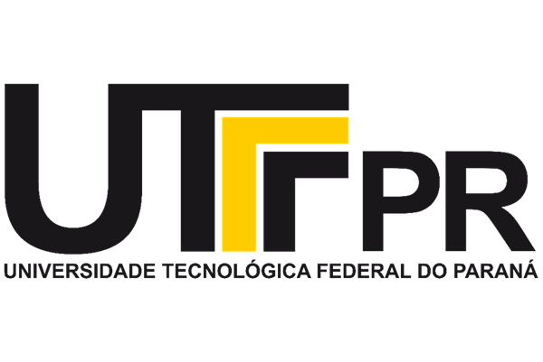

# UTF-Projetos
<p align="center">
  
</p>

---


## 📖 Sobre o Repositório

Este repositório contém **exercícios, listas e projetos práticos** desenvolvidos durante o curso de **Tecnologia da Informação** na **Universidade Tecnológica Federal do Paraná (UTFPR)**.

O objetivo é reunir implementações em linguagem **C** aplicadas aos conteúdos de **lógica de programação, estruturas condicionais, laços de repetição, vetores, funções e projetos aplicados**.

---
## 📂 Estrutura

UTF-Projetos/
│── algorithms01/
│   ├── class/     # Exercícios resolvidos em aula
│   ├── assets/    # Exercícios de reforço
│   ├── book/      # Exercícios do livro
│── README.md


---

## 📘 Conteúdos

- **Exercícios sequenciais** (operações matemáticas e fórmulas)
- **Estruturas condicionais** (`if`, `else`, `switch`)
- **Laços de repetição** (`for`, `while`, `do while`)
- **Vetores e matrizes**
- **Funções e modularização**
- **Projetos aplicados em C**

---

## 🛠️ Tecnologias Utilizadas

- Linguagem de Programação **C**
- Bibliotecas padrão: `stdio.h`, `math.h`, `locale.h`, `string.h`
- Compiladores recomendados: **GCC** ou **Clang**

---

## ▶️ Como Executar


1. Clone o repositório:
   ```bash
   git clone https://github.com/alandiogor/UTF-Projetos.git
   cd UTF-Projetos/Exercicios-C


